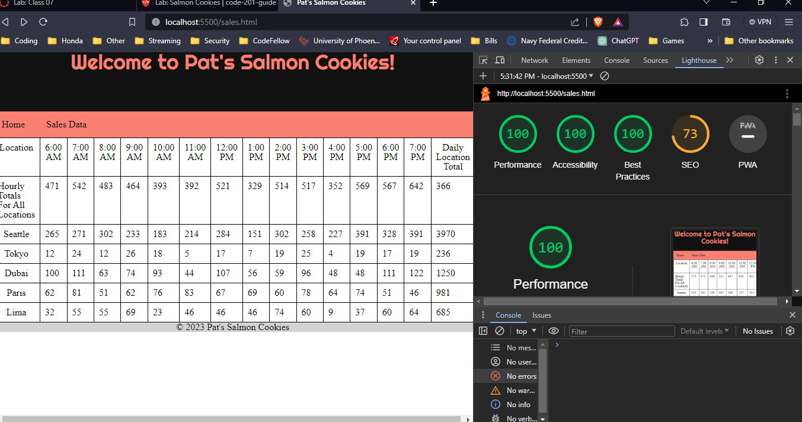

# cookie-stand# LAB - Number 07-classes/tables

## Project Name cookie stand

I build an app with a direct and powerful purpose. It does all of the things that it accomplishes well. I should describe the purpose and functionality so those that visit my README understand the app

### Author: Student/Group Name joshua watts

### Links and Resources chatgpt

* [submission PR](http://xyz.com)
* Any Links you used as reference

### Lighthouse Accessibility Report Score 100

### Reflections and Comments
Today was a great day, the JS came easy today I think I am beginning to write it better and faster I can see it cleareer even if i dont fully understand its meaning i can see what its doing. the struggle today was the table this took almost an hour to get correct mostly because the footer totals was fighting me, but i was able to eventually able to get it at the bottom. i enjoyed working with the classes today and seeing them gives me a little hope im not completely out of my depth.
