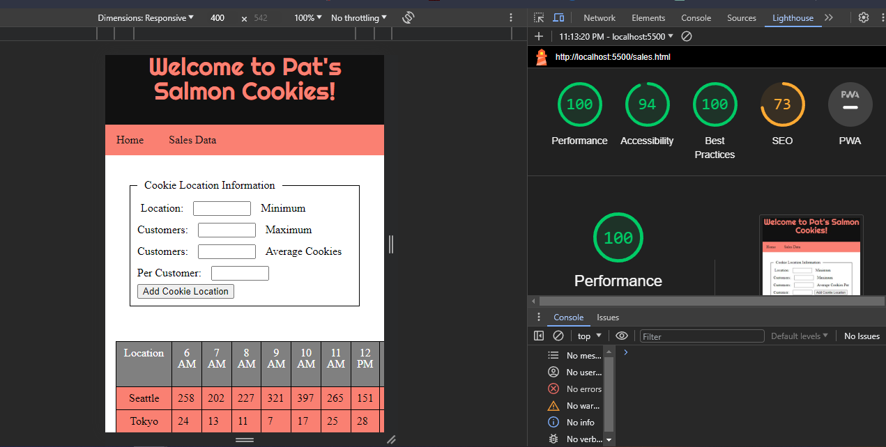

# lab Number 09-forms

# cookie stand

I build an app with a direct and powerful purpose. It does all of the things that it accomplishes well. I should describe the purpose and functionality so those that visit my README understand the app

### Author:  joshua watts

### Links and Resources chatgpt

* [submission PR](http://xyz.com)
* Any Links you used as reference

### Lighthouse Accessibility Report Score 94

Today was challenging but rewarding it was a struggle but was rewarding in the end to finsally overcome my former obstacle of the total cell in the table and over come the challenge of the forms. Definitely could of worked faster today but I think taking my time helped me undertand better and get my styling right in css without getting as frustrated making it a more productive day.
